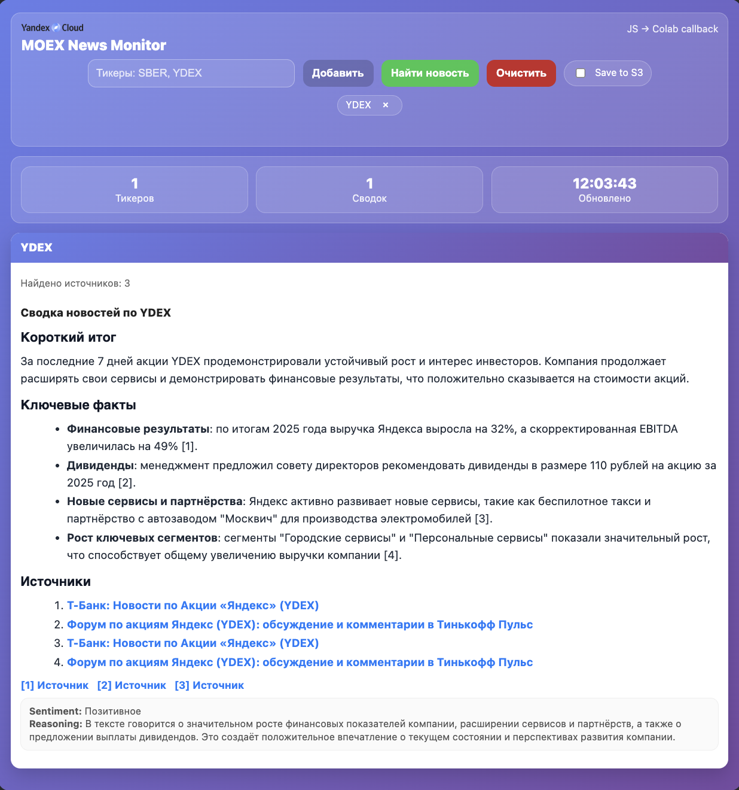

# Навигация: Агент мониторинга биржевых новостей
**Агент** с *websearch* мониторинга новостей по акциям *Мосбиржи*: *WebSearch Responses API* для выборки публикаций, *Object Storage* для сохранения истории и последующей аналитики

---

## Содержание

### 1. Введение
*   **Назначение**: Мониторинг новостей для инвесторов и трейдеров.
*   **Стек**: `Responses API`, `AI Studio`, `Object Storage`.

### 2. Архитектура решения
*   Схема потоков данных: `WebSearch` → `Agent Analysis` → `Digest` → `S3 Storage`.
*   Роли и права доступа сервисных аккаунтов.

### 3. Подготовка окружения
*   Установка библиотек (`openai`, `boto3`, `pydantic`).
*   Инициализация клиентов S3 и OpenAI-compatible API.
*   Тестовый вызов Yandex LLM.

### 4. Логика приложения
*   **WebSearch Tool**: Настройка доменов поиска (moex.com, e-disclosure.ru и др.).
*   **JSON Schema**: Pydantic-модели для структурирования ответов (`Influence`, `NewsArticle`).
*   **Агент**: Функции анализа тональности и влияния событий на котировки.
*   **S3 Экспорт**: Механизм сохранения дайджестов в облачное хранилище.

### 5. Тестирование
*   Настройка системных промптов (роль "Финансовый аналитик").
*   Запуск агента по тикерам (SBER, MAGN, YDEX).
*   Интерактивный HTML-виджет для проверки работы.

---

## Best Practices

*   **Выбор модели**: Используйте `YandexGPT Pro` для глубокого анализа и `YandexGPT Lite` для быстрых и менее затратных задач.
*   **Промпт-инжиниринг**: Создавайте детальные системные промпты, описывающие роль агента, формат ответа и ограничения, как показано в разделе `5.1`. Совмещайте базовый системный промпт с промптами, решающими определённый кейс
*   **Безопасность**: Храните API-ключи и другие учетные данные в переменных окружения или `.env` файле, избегая их прямого включения в код.
*   **Структурированный вывод**: Применяйте Pydantic-модели для получения предсказуемого JSON ответа от модели, что упрощает парсинг. 
*   **Ограничение поиска**: Для повышения релевантности и снижения "шума" указывайте целевые домены в `WEB_SEARCH_TOOL`.

---

## Дополнительные ресурсы

* 🔗 **AI Studio YandexGPT**: [Обзор и документация](https://yandex.cloud/ru/docs/ai-studio/quickstart/yandexgpt)
* 🔗 **OpenAI-совместимое API**: [Документация по использованию SDK](https://yandex.cloud/ru/docs/foundation-models/concepts/openai-compatibility)
* 🔗 **Object Storage**: [Работа с S3-совместимым хранилищем](https://cloud.yandex.ru/docs/storage/s3/)
* 🔗 **Примеры кода**: [Репозиторий с примерами Yandex AI Studio API](https://github.com/yandex-ai-studio/yandex-ai-studio-api-examples)
* 🔗 **Регионы для поиска**: [Таблица регионов Яндекса](https://yandex.ru/dev/xml/doc/ru/reference/regions)

---

**Версия:** 1.0  
**Последнее обновление:** Декабрь 2025  
**Язык:** Python 3.10+